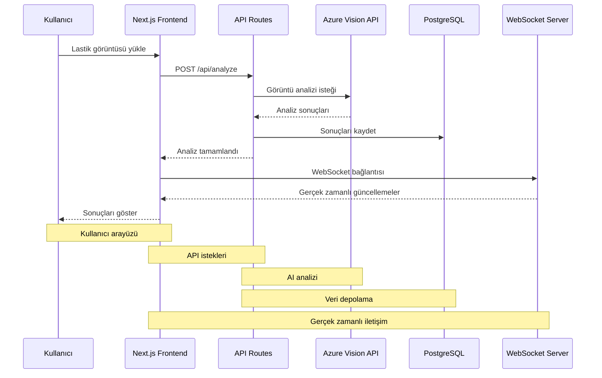

# Veri Akış Diyagramı

## Akış Açıklamaları

### 1. Kullanıcı Etkileşimi
- Kullanıcı lastik görüntüsünü yükler
- Form verilerini doldurur
- Analiz başlatır

### 2. API İşlemleri
- Görüntü doğrulama
- Azure Vision API'ye gönderme
- Sonuçları işleme
- Veritabanına kaydetme

### 3. Gerçek Zamanlı İletişim
- WebSocket bağlantısı
- İlerleme güncellemeleri
- Hata bildirimleri
- Sonuç iletimi

### 4. Veri Depolama
- Kullanıcı bilgileri
- Analiz sonuçları
- Görüntü referansları
- İşlem geçmişi 