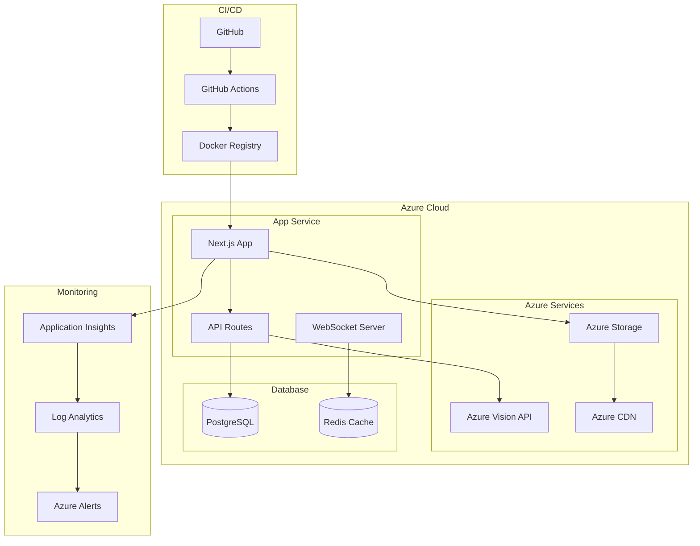

# Deployment Diyagramı

## Deployment Bileşenleri

### Azure Cloud
- **App Service**: Web uygulaması hosting
- **Azure Services**: AI ve depolama servisleri
- **Database**: Veritabanı servisleri

### CI/CD Pipeline
- **GitHub**: Kod deposu
- **GitHub Actions**: Otomatik deployment
- **Docker Registry**: Container registry

### Monitoring
- **Application Insights**: Performans izleme
- **Log Analytics**: Log yönetimi
- **Azure Alerts**: Uyarı sistemi

## Deployment Adımları

1. Kod değişiklikleri GitHub'a push edilir
2. GitHub Actions otomatik olarak tetiklenir
3. Docker image build edilir
4. Image Azure Container Registry'ye push edilir
5. App Service yeni image'ı deploy eder
6. Monitoring sistemleri değişiklikleri izler 