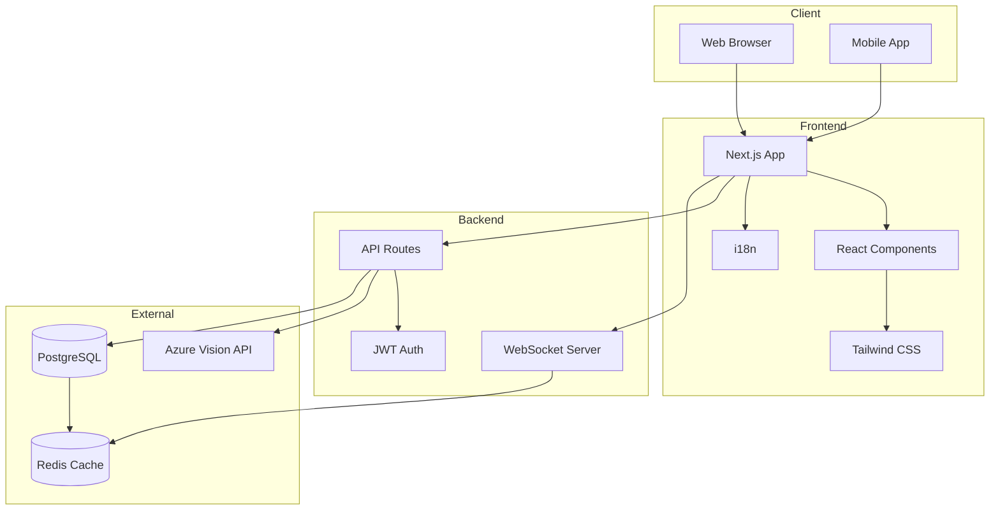

# Sistem Mimarisi Diyagramı

## Bileşen Açıklamaları

### Client Katmanı
- **Web Browser**: Modern web tarayıcıları
- **Mobile App**: Mobil uygulama (gelecek)

### Frontend Katmanı
- **Next.js App**: Ana uygulama framework'ü
- **React Components**: UI bileşenleri
- **Tailwind CSS**: Stil framework'ü
- **i18n**: Çoklu dil desteği

### Backend Katmanı
- **API Routes**: REST API endpoint'leri
- **WebSocket Server**: Gerçek zamanlı iletişim
- **JWT Auth**: Kimlik doğrulama

### External Servisler
- **Azure Vision API**: Görüntü analizi
- **PostgreSQL**: Ana veritabanı
- **Redis Cache**: Önbellek ve oturum yönetimi 