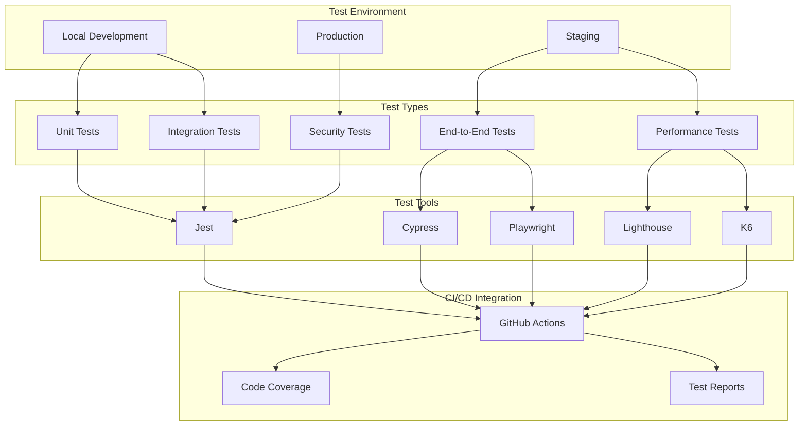

# Test Stratejisi Diyagramı

## Test Kategorileri

### 1. Unit Tests
- Bileşen testleri
- Hook testleri
- Util fonksiyonları
- Servis testleri

### 2. Integration Tests
- API entegrasyonları
- Form işlemleri
- Veri akışı
- State yönetimi

### 3. End-to-End Tests
- Kullanıcı akışları
- Kritik iş süreçleri
- Hata senaryoları

### 4. Performance Tests
- Sayfa yükleme süreleri
- API yanıt süreleri
- Kaynak kullanımı
- Ölçeklenebilirlik

### 5. Security Tests
- Güvenlik açıkları
- Kimlik doğrulama
- Yetkilendirme
- Veri güvenliği

## Test Ortamları

### Local Development
- Hızlı geliştirme
- Anlık geri bildirim
- Debug kolaylığı

### Staging
- Production benzeri ortam
- Entegrasyon testleri
- Performans testleri

### Production
- Canlı sistem testleri
- Güvenlik testleri
- Monitoring 